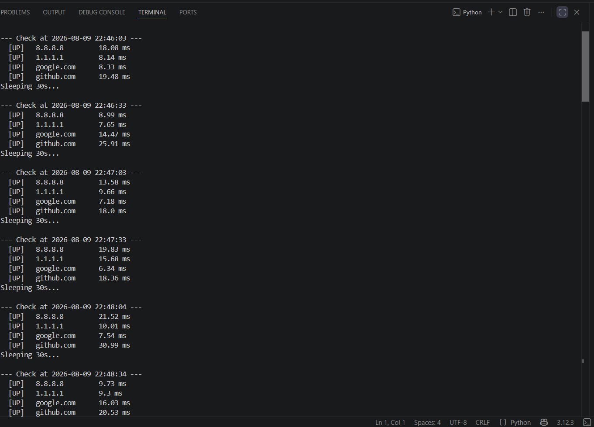
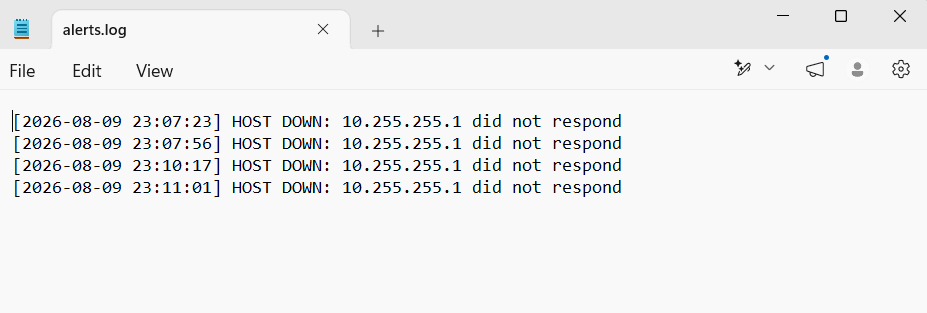
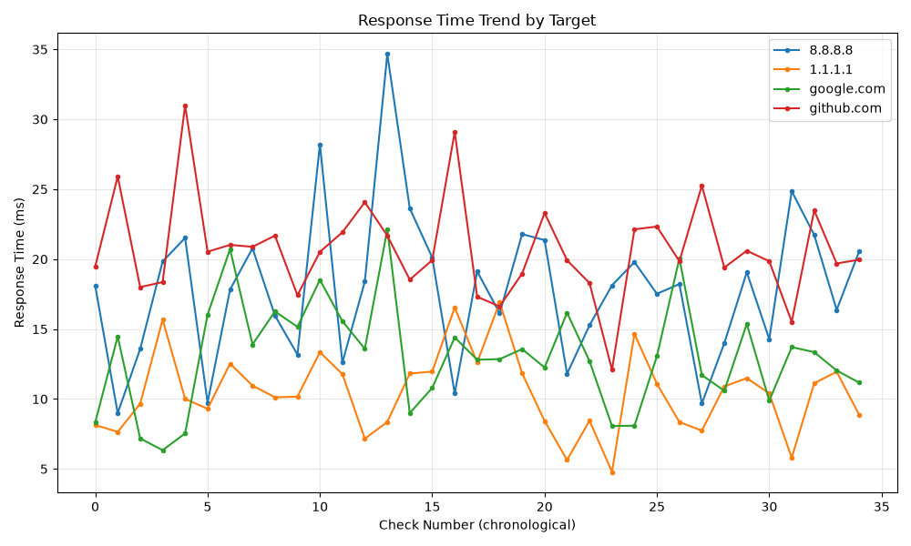

# Network Monitoring & Incident SLA Dashboard

A Python and SQL-based monitoring tool that performs real-time uptime checks, automated incident alerting, and SLA-style reporting — simulating the core workflows of a NOC / IT Operations environment.

## Overview

This project combines **network monitoring** (ping-based uptime checks, latency measurement), **data analysis** (SQL aggregation, anomaly detection), and **automated alerting/visualization** — a lightweight simulation of the monitoring tooling used in NOC, IT Support, and Infrastructure Operations environments.

## Architecture / Workflow

config.json
     │
     ▼
uptime_monitor.py ──(ping targets)──▶ network_monitor.db (SQLite)
                                              │
                                              ▼
                                      audit_report.py
                                     /       │        \
                                    ▼        ▼         ▼
                          uptime_report.csv  uptime_chart.png  alerts.log

## Tech Stack

| Component | Technology |
|---|---|
| Monitoring | Python, `ping3` (ICMP ping) |
| Data Storage | SQLite (`sqlite3`) |
| Data Analysis | SQL (aggregate queries, anomaly detection) |
| Visualization | `matplotlib` |
| Configuration | JSON |
| Reporting | CSV export |

## How It Works

1. **`config.json`** — central configuration: target hosts, check interval, database/log filenames, and the high-latency alert threshold. Change monitoring behavior here without touching the code.
2. **`uptime_monitor.py`** — pings each configured host at regular intervals, logs status (up/down) and response time to a SQLite database, and writes a timestamped alert whenever a host goes down or responds above the latency threshold.
3. **`audit_report.py`** — runs SQL queries against the logged data to calculate uptime %, average/max latency, downtime events, and high-latency anomalies. Prints a console summary, exports a CSV report, and generates a response-time trend chart.
4. **`sql/`** — the core SQL queries (uptime summary, latency analysis, anomaly detection) extracted as standalone `.sql` files for direct review.

## Installation

```bash
git clone https://github.com/Wan-Aisyarifatul/network-uptime-monitoring.git
cd network-uptime-monitoring
pip install -r requirements.txt
```

## How to Run

```bash
python uptime_monitor.py    # let it run for a few minutes, then Ctrl+C to stop
python audit_report.py      # generates report, CSV, and chart
```

## Expected Outputs

- `network_monitor.db` — raw ping log data
- `alerts.log` — timestamped alerts for downtime / high latency
- `output/uptime_report.csv` — summary table (uptime %, latency stats per host)
- `output/uptime_chart.png` — response time trend chart

## Configuration

Edit `config.json` to change monitored hosts, check frequency, or the latency alert threshold — no code changes needed:

```json
{
    "targets": ["8.8.8.8", "1.1.1.1", "google.com", "github.com"],
    "check_interval_seconds": 30,
    "db_file": "network_monitor.db",
    "alert_log_file": "alerts.log",
    "high_latency_threshold_ms": 150
}
```

## Screenshots

**Monitoring Console**


**Alert Log**


**Uptime Chart**


## Skills Demonstrated

- Real-time network monitoring and ICMP-based connectivity checks
- SQL data modeling, aggregation, and anomaly detection queries
- Python scripting for automation and system monitoring
- Incident logging and alert-threshold configuration
- Data visualization and CSV-based reporting
- Configuration-driven design (no hardcoded values)

## Resume-Ready Achievement Bullets

- Built a Python and SQL-based network monitoring tool performing real-time ICMP uptime checks across multiple hosts, with automated incident alerting and SLA-style reporting
- Designed SQL queries to calculate uptime percentage, latency trends, and anomaly detection across logged network data, exporting results to CSV and visual trend charts

## Future Enhancements

- Streamlit web dashboard for live monitoring visualization
- Email/Telegram alert notifications
- Multi-threaded monitoring for larger host lists
- Power BI live dashboard connection
- Scheduled deployment via cron / Windows Task Scheduler

## Author

Wan Aisyarifatul Nor Binti Wan Aziz